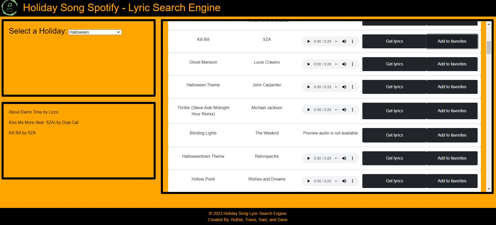

# Project Title

Holiday Playlist & Lyric Generator

## Description

-  An application that gives the user the ability to search for playlists based on a holiday. A playlist is displayed with an audio preview,
   as well as lyrics for the song.
-  Webpage was developed to enable the user easy access to Holiday themed music and lyrics.

## Usage

-  Select a holiday from the dropdown menu and the playlist will be instantly displayed. Each song is displayed with a media player that
   gives a 30 second preview (given the audio is available through the API). The lyrics will be displayed by click event, if lyrics cannot
   be found through the API a message will be displayed instead of lyrics. After each playlist is generated, a favorites section below the
   dropdown menu will save the three most recent 'favorited' songs so the user can reference to it.

## Technologies Used

-  Spotify for Web Developers API
-  Musixmatch Lyrics API
-  Bootstrap CSS Framework
-  Jquery

## Deployment

-  github url for repo
-  https://github.com/ruthiepina/Project-1

-  url for live page
-  https://ruthiepina.github.io/Project-1/

## Screenshot

-  

## Help

-  Tom Gold (TA)
-  Sean King (TA)

## Contributors

-  [Dane Larsen](https://github.com/DaneLarsen1)
-  [Ruthie Pina](https://github.com/ruthiepina)
-  [Sam Grow](https://github.com/HoneyBuzz94)
-  [Travis Nielson](https://github.com/TNielson78)

## Credits

- https://getbootstrap.com/ 
- https://developer.mozilla.org/en-US/ 
- https://www.w3schools.com/
- https://rapidapi.com/Paxsenix0/api/musixmatch-lyrics-songs
- https://developer.spotify.com/documentation/web-api

## License

MIT License
